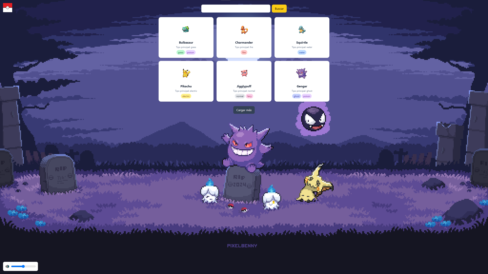

# ⚡ Pokédex

Proyecto de una Pokédex interactiva que permite buscar, capturar y visualizar Pokémon usando la **PokeAPI**.

---

## 🔍 Características

- 🔎 Búsqueda de Pokémon por nombre  
- 🎴 Visualización de tarjetas con sprites oficiales  
- ⚡ Sistema de captura de Pokémon  
- 🎒 Inventario de Pokémon capturados  
- 📊 Visualización de estadísticas (HP, Attack, Defense, Speed, etc.)  
- ➕ Botón de "Cargar más" Pokémon  
- 🎨 Diseño moderno con Tailwind CSS  

---

## 🚀 Cómo usarlo

1. Abre el sitio desplegado en GitHub Pages  
2. Escribe el nombre de un Pokémon (ej: pikachu)  
3. Presiona **Buscar**  
4. Haz clic en **⚡ Capturar** para guardarlo en tu inventario  
5. Abre la Pokébola 🎒 para ver tus Pokémon capturados  
6. Usa **Cargar más** para ver más Pokémon  

---

## 🧠 Tecnologías utilizadas

- JavaScript (ES6+)
  - `fetch`
  - `async / await`
  - `Promise.all`
- HTML5
- Tailwind CSS
- [PokeAPI](https://pokeapi.co/)

---

## 🎮 Funcionalidades extra

- Inventario tipo Pokédex 🎒  
- Sistema de captura sin duplicados  
- Panel de estadísticas por Pokémon  
- Interfaz estilo videojuego  
- Audio de captura 🔊 (opcional)  

---

## 🌐 Deploy

👉 https://woop1.github.io/Pok-dex/

---

## 📸 Vista previa

